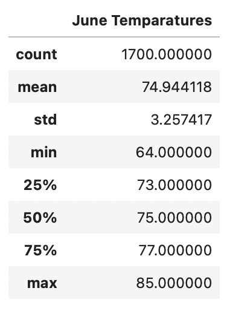
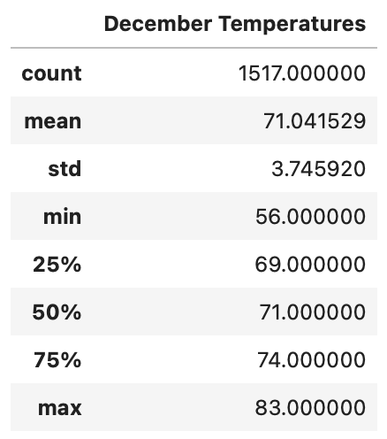

# surfs_up

## Overview
The purpose of this analysis is to provide temperature trends in Oahu for the months of June and December so it can be determined if a surf and ice cream shop business is sustainable year-round.

## Results 
### Summary Statistics for June
I filtered the temperature data down to the month of June over all years of data. After converting to a list and then DataFrame, I calculated the summary statistics for June temperatures. With 1700 temperatures recorded in June, the low, high, and average temps were found to be:
- Low: 64
- High: 85
- Average: 74.9

|*June Temperatures Summary Statistics*|
|:--:|
||

### Summary Statistics for December
I followed the same process to get the temperature statistics for the month of December. With 1517 temperatures recorded in December, the low, high, and average temps were found to be:
- Low: 56
- High: 83
- Average: 71

|*December Temperatures Summary Statistics*|
|:--:|
||

## Summary 
The results of the two queries run show that temperatures in June are overall higher than those in December. However, the temperatures in December aren't low enough to keep the client from opening a surf and ice cream shop in Oahu and running it year-round. With a low in the 50s and an average temperature of 71 in December, it's still possible to comfortable surf with a bodysuit and enjoy some ice cream afterwards. 

To provide further analysis, I would get a count of days in June and December where temperatures were below 70 degrees - a more comfortable temperature for surfing and ice cream consumption. In addition to temperature, I would also run a query for precipitation in the months of June and December. If it is raining throughout the month of December, surfing may not be as fun. 